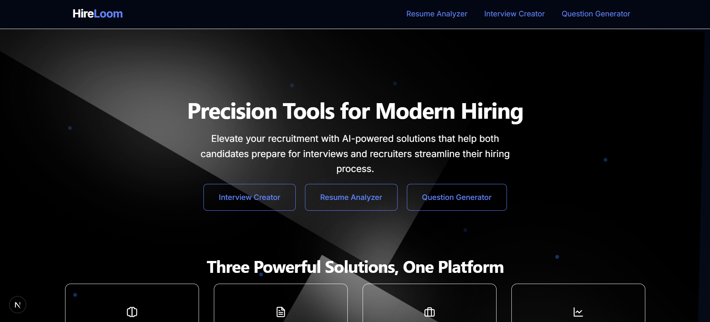

HireLoom



Smart AI-Powered Interview Preparation Assistant

Problem Statement
Traditional interview processes are time-consuming, inconsistent, and often fail to effectively assess candidate qualifications. Recruiters struggle with creating relevant questions, while candidates face unpredictable interview experiences.

Objective
HireLoom aims to revolutionize the interview process by leveraging AI to generate personalized interview questions based on resume analysis. Our platform streamlines recruitment workflows, ensures consistent candidate evaluation, and provides comprehensive assessment tools for better hiring decisions.

Tech Stack
- Frontend: Next.js, React
- Backend: Next.js API Routes
- AI Integration: Google Gemini API
- Styling: Tailwind CSS
- Deployment: Vercel

Key Features

AI-Powered Question Generation
- Resume Analysis: Upload a resume and get tailored interview questions
- Industry-Specific Questions: Questions customized to match job roles and industry requirements

Comprehensive Assessment Tools
- Real-time Evaluation: Analyze candidate responses during interviews
- Performance Metrics: Track and compare candidate performance with detailed analytics

Interview Management
- Create Interviews: Set up interviews with customized parameters
- Join Interviews: Seamless interface for candidates to join scheduled interviews
- Interview History: Access past interviews and their results

Resume Analysis
- Resume Parsing: Extract and analyze key information from resumes
- Skill Mapping: Match candidate skills against job requirements

Getting Started

Prerequisites

Before running the project, make sure you have the following installed:

- **Node.js** (v18 or later)
- **npm** (v9 or later) or **yarn**
- **Google Gemini API key** - Required for AI functionality

Installation

1. **Clone the repository**

```bash
git clone https://github.com/samarthyaveer/HireLoom.git
cd HireLoom
```

2. **Install dependencies**

```bash
npm install
# or
yarn install
```

3. **Set up environment variables**

Create a `.env.local` file in the root directory with the following variables:

```
GEMINI_API_KEY=your_gemini_api_key_here
GEMINI_MODEL=gemini-2.0-flash
```

> **Note:** You can copy the `.env.local.example` file and rename it to `.env.local`, then replace the placeholder values with your actual API key.

4. **Start the development server**

```bash
npm run dev
# or
yarn dev
```

5. **Open your browser**

Navigate to [http://localhost:3000](http://localhost:3000) to see the application running.

Environment Variables

The application requires the following environment variables:

| Variable | Description | Required | Default |
|----------|-------------|----------|---------|
| `GEMINI_API_KEY` | Your Google Gemini API key | Yes | None |
| `GEMINI_MODEL` | The Gemini model to use | No | gemini-2.0-flash |

Getting a Gemini API Key

1. Go to [Google AI Studio](https://ai.google.dev/)
2. Sign in with your Google account
3. Navigate to the API section
4. Create a new API key
5. Copy the key and add it to your `.env.local` file

Usage Guide

1. Home Page: Navigate through the main interface showcasing features
2. Create Interview: Upload a resume and set interview parameters
3. Join Interview: Enter an interview session using the provided link/ID
4. View Results: Access detailed analysis of interview performance

Future Scope
- Multi-language support for global recruitment
- Video interview integration with real-time AI analysis
- Advanced analytics dashboard for recruitment teams
- Integration with popular ATS (Applicant Tracking Systems)

Contributing
Contributions are welcome! Please feel free to submit a Pull Request.

License
This project is licensed under the MIT License - see the LICENSE file for details.

Learn More

To learn more about Next.js, take a look at the following resources:

- [Next.js Documentation](https://nextjs.org/docs) - learn about Next.js features and API.
- [Learn Next.js](https://nextjs.org/learn) - an interactive Next.js tutorial.

You can check out [the Next.js GitHub repository](https://github.com/vercel/next.js) - your feedback and contributions are welcome!

Deployment

Deploying to Vercel

This project is optimized for deployment on Vercel. Follow these steps to deploy:

1. Push your code to a GitHub repository
2. Go to [Vercel](https://vercel.com) and sign up/login
3. Click "New Project" and import your GitHub repository
4. Configure the project:
   - Set the framework preset to "Next.js"
   - Add environment variables (GEMINI_API_KEY, GEMINI_MODEL)
5. Click "Deploy"

Environment Variables on Vercel

Make sure to add the same environment variables to your Vercel project:

1. Go to your project on Vercel
2. Navigate to Settings > Environment Variables
3. Add the GEMINI_API_KEY and GEMINI_MODEL variables
4. Redeploy your application for the changes to take effect

For more information, check out the [Next.js deployment documentation](https://nextjs.org/docs/app/building-your-application/deploying).